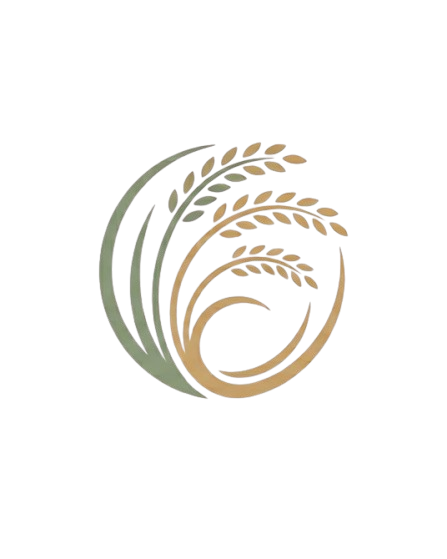
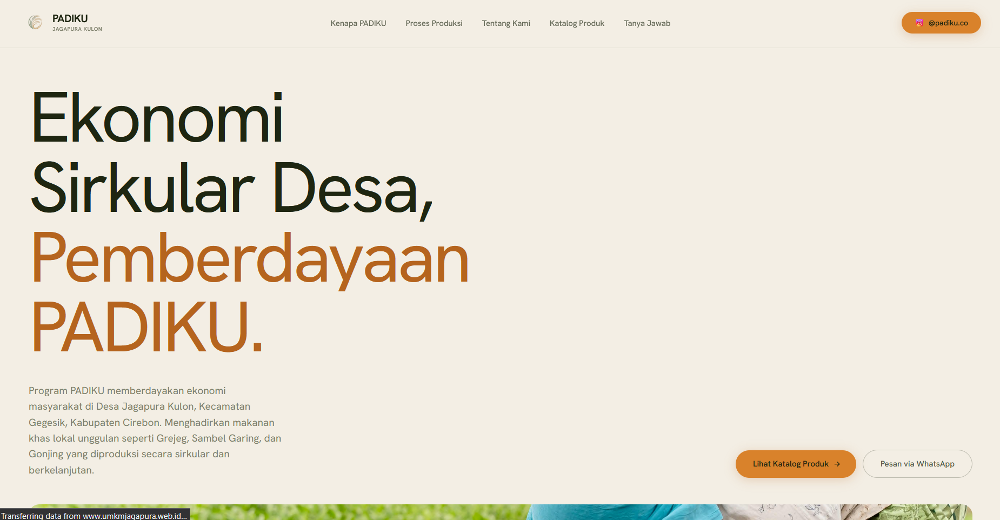

<div align="center">
  

# Program PADIKU

Digitalisasi UMKM & Ekonomi Sirkular Desa Jagapura Kulon, Kecamatan Gegesik, Kabupaten Cirebon.
<br />
Platform resmi E-Katalog digitalisasi produk UMKM unggulan desa seperti Grejeg, Sambel Garing, dan Gonjing, yang memberdayakan ekonomi lokal masyarakat.

[](https://github.com/andi-nugroho/padikusirkular/actions)
[](https://github.com/andi-nugroho/padikusirkular/stargazers)

<br />



</div>

- **Live System**: [umkmjagapura.web.id](https://umkmjagapura.web.id)
- **Desa**: Jagapura Kulon, Kec. Gegesik, Kab. Cirebon

## Mengapa PADIKU?

- **E-Katalog UMKM**: Memfasilitasi pemasaran produk lokal unggulan desa seperti Grejeg, Sambel Garing, dan Gonjing secara digital.
- **Ekonomi Sirkular**: Memberdayakan ekonomi lokal dengan bahan baku dari desa, diproduksi oleh masyarakat desa, untuk kesejahteraan desa.
- **Pemesanan Mudah**: Terintegrasi langsung dengan WhatsApp pengelola UMKM desa untuk kemudahan pemesanan.
- **Desain Web Modern**: UI yang estetik, hangat, dan responsif dengan performa tinggi untuk kemudahan akses informasi.
- **Teknologi Cepat**: Dibangun dengan Next.js App Router (React 19) dan Framer Motion untuk transisi dan animasi halus.

## Tech Stack

- **Framework**: Next.js 16 + React 19 + TypeScript
- **Styling**: Tailwind CSS v3 + Vanilla CSS
- **Animasi**: Framer Motion
- **UI Components**: Radix UI + shadcn/ui
- **Icons**: Lucide React

## Local Development

### Prerequisites

- Node.js 18+
- npm (Node Package Manager)

### Install

```bash
npm install
```

### Start development server

```bash
npm run dev
```

Buka [http://localhost:3000](http://localhost:3000) (atau port yang berjalan).

## Scripts

- `npm run dev`: Menjalankan server development
- `npm run build`: Menjalankan production build
- `npm run start`: Menjalankan production server
- `npm run lint`: Menjalankan pengecekan ESLint
- `npm run type-check`: Menjalankan pengecekan tipe TypeScript

## Architecture Overview

- `src/app`: Konfigurasi Next.js App Router dan halaman/layout utama.
- `src/components/sections`: Komponen antarmuka per-bagian (seperti Navbar, Footer, Hero, dll).
- `src/components/ui`: Komponen UI modular (Button, dll) dari sistem desain.
- `public/`: Aset statis berupa gambar dan logo.

## Deployment

Dioptimalkan untuk deployment pada Vercel atau environment Node.js yang mendukung Next.js. Siap untuk pipeline CI/CD otomatis melalui GitHub Actions.

## Contributing

Kami sangat terbuka dengan kontribusi untuk memajukan sistem PADIKU. Silakan buat *Pull Request* atau buka *Issue* baru untuk diskusi lebih lanjut.

## License

MIT © 2026 KKM UMC (Universitas Muhammadiyah Cirebon) & Andi Nugroho.
